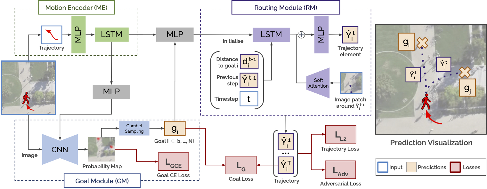
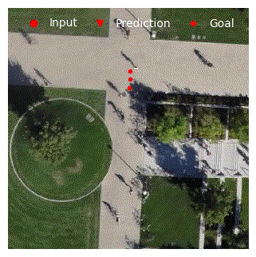

# GoalGAN

This repository provides the official PyTorch Lightning implementation of Goal-GAN, presented at [ACCV 2020](http://accv2020.kyoto/)(Oral)

[<b>Goal-GAN: Multimodal Trajectory Prediction Based on Goal Position Estimation</b>  
Patrick Dendorfer, Aljoša Ošep, Laura Leal-Taixé](https://arxiv.org/abs/2010.01114)  

## Motivation
In this paper, we present Goal-GAN, an interpretable and end-to-end trainable model for human trajectory prediction. 
We model the task of trajectory prediction as an intuitive two-stage process: (i) goal estimation, which predicts the most likely target positions of the agent, followed by a (ii) routing module, which estimates a set of plausible trajectories that route towards the estimated goal. 
We leverage information about the past trajectory and visual context of the scene to estimate a multimodal probability distribution over the possible goal positions, which is used to sample a potential goal during the inference. 


## Model
Our model consists of three key components: Motion Encoder (ME), Goal Module (GM), and Routing Module (RM).


<div align='center'>
</img>
</div>
<ul>
  <li> <p><b>Motion Encoder (ME):</b>
        <br>extracts  the  pedestrians’  dynamic  features  recur-sively with a long short-term memory
        (LSTM) unit capturing the speed anddirection of motion of the past trajectory.</p>
</li>
<li><p><b>Goal Module (GM):</b>
    <br>combines visual scene information and dynamic pedestrian features to predict
the goal position for a given pedestrian. This module estimates
the probability distribution over possible goal (target) positions,
    which is in turn used to sample goal positions.</p></li>
<li><p><b>Routing Module (RM):</b>
    <br>generates the trajectory to the goal position sampled from the GM. While the goal position of the prediction is determined by the GM, the RM generates feasible paths to the predetermined goal
    and reacts to obstacles along the way by using visual attention.</p></li>
</ul>

The model is trained with an adversarial loss for which the discriminator classifies the predictions as 'real/fake' by considering input trajectory, prediction, and visual input of the scene.
## Visualizing Multimodality
<table align=center>    
<p>Below we show an examples of predictions made by our model in multimodal scenarios. We demontrate the probability map as heatmap and the sampled intermediate goal. The decoder is conditioned on the estitimated goal and generates the trajectory denotey by triangles.</p>
    <tr>
      <td>
        
      </td>
      <td>
        
      </td>
      <td>
      
    </td>
  </tr>
</table>
      

## Reference
If you use this code for your research, please cite our work:

```
@inproceedings{dendorfer2020accv,
  title={Goal-GAN: Multimodal Trajectory Prediction Based on Goal Position Estimation}, 
  author={Patrick Dendorfer and Aljoša Ošep and Laura Leal-Taixé},
  year={2020},
  booktitle={Asian Conference on Computer Vision},
  }
```


## Setup

All code was developed and tested with Python 3.6.3, PyTorch 1.6.0., and PyTorch-Lightning 0.9.0.

You can setup a virtual environment and install the required packages:

```
pip install -r requirements.txt   # Install dependencies
```
## Training Models
To train your models set up the config ```yaml``` files in the config folder, adjusting the [Hyperparameters](HYPERPARAMETERS.md).
To start the training run:
```
python run.py
```
You can also change the configuration by directly typing into the command line, e.g.:
```
python run.py batch_size=64 lr_scheduler_G=1e-4
```
The training process and models are saved and logged with tensorboard. The final model performance is evaluated on the test set and save in 'results.pt'. You can use this [script](/utils/collect_results.py) writing all results into a csv in [resultCSV](resultCSV).


## Synthetic Dataset

<table align=center>    
    <tr>
       <td align='center' width=200px>
        Trajectories in Dataset
        
      </td>
       <td align='center' width=200px>
         Feasible Area
        
      </td>
      <td>
        <p>To train our model and demonstrate its ability to learn a distribution of feasible goal positions we create a synthetic dataset. We generate trajectories using the Social Force Model <a href="https://arxiv.org/abs/cond-mat/9805244">(Helbing & Molar, 98)</a> in the hyang 4 scene of the SDD dataset. To ensure the feasibility of the generated trajectories, we use a two-class (manually labeled) semantic map, that distinguishes between feasible (walking paths) from unfeasible (grass) areas. We simulate 1300 trajectories approaching and passing the two crossroads in the scene and split them into train (800), validation (200), and test (300) <a href="https://github.com/dendorferpatrick/GoalGAN/tree/master/datasets/stanford_synthetic"> sets</a>. We use the pixel-world correspondences <a href="datasets/stanford_synthetic/H_SDD.txt">data</a> provided by the authors of <a href="https://arxiv.org/abs/1806.01482">SoPhie</a>.</p>
    </td>
  </tr>
</table>

## Data Format
To run or re-train the model with new data provide the trajectories in a txt file with the following format:

```<frame_id>, <ped_id>, <x>, <y>```

As well as RGB images of the corresponding scene in the dataset folder.


## Contact
If you find any bugs or have any questions, please open an issue or contact me via mail (patrick.dendorfer@tum.de).
